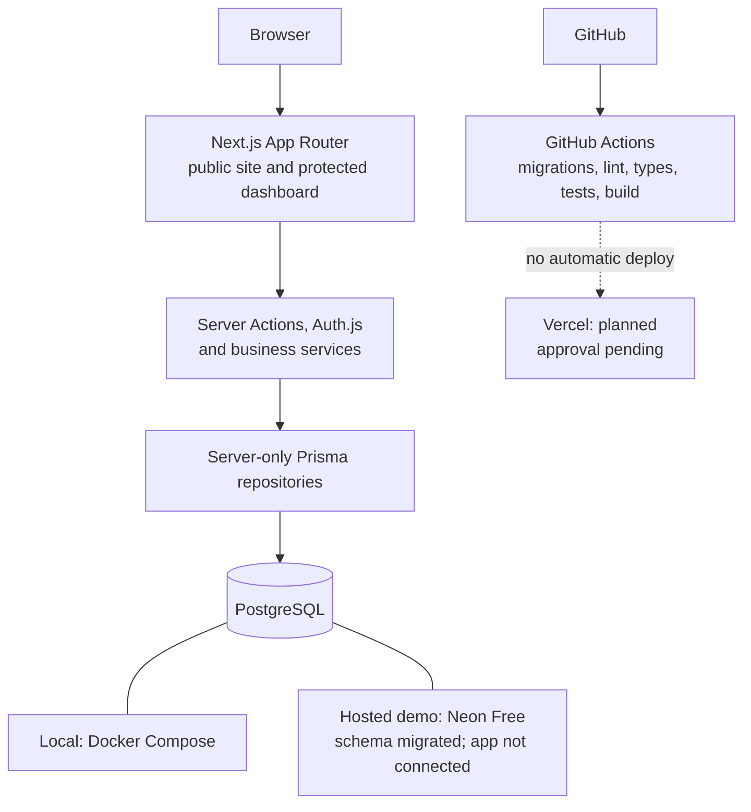

# NexaService

NexaService is a **fictional commercial workplace and facility-services demo**. It pairs a public service website with a private staff workspace in one Next.js application. It is a portfolio engineering project, not an operating business: there are no real customers, services for sale, or business follow-ups. The enquiry form works for fictional demonstration data only.

The problem it explores is straightforward: a visitor needs a clear way to understand services and send an enquiry, while staff need a protected place to review, qualify, and assign the resulting lead. The project shows the full path from public form to relational data to role-controlled operations without adding a separate backend.

> **Deployment status:** Local development and CI are working. The Neon Free demo database has the three checked-in migrations. No application is deployed, no production ADMIN has been created, and no hosted smoke test or live URL exists. Vercel Hobby deployment is paused until Vercel confirms in writing that this specific fictional portfolio use is permitted. [Release details](docs/DEPLOYMENT.md) · [Definition of Done](docs/DEFINITION_OF_DONE.md)

## People and workflows

| Role | Implemented experience |
| --- | --- |
| Visitor | Browse the homepage, About page, published Services and detail pages, and labeled fictional example Testimonials. Submit a general demo enquiry or choose a published Service; no account is needed. |
| STAFF | Sign in; view and search/filter Leads; read details and private notes; update status; add notes; view operational dashboard metrics. The current policy lets STAFF see all Leads. |
| ADMIN | All STAFF work, plus Lead assignment, Service and Testimonial draft/publication management, Site Settings, and staff account creation, editing, disablement, and reactivation. |

A valid enquiry is server-validated, optionally linked to a **currently published** Service, then stored as a `NEW`, unassigned Lead. STAFF or ADMIN can move it through `CONTACTED`, `QUALIFIED`, `WON`, or `LOST` and add internal notes; only ADMIN can assign an active user. Unpublishing a Service removes it from public selection while preserving its historical Lead links. Dashboard counts cover current statuses, the current UTC month, six months of activity, recent Leads, and linked-Service enquiry counts. They are enquiry metrics, not revenue or confirmed sales.

## Architecture



The UI, validation/business rules, and Prisma data access live in separate layers. Server Actions handle form mutations; the Auth.js Route Handler is the explicit HTTP endpoint. Protected reads and writes recheck the current user and role on the server. [Architecture details](docs/ARCHITECTURE.md) · [Database design](docs/DATABASE.md) · [Interface contracts](docs/API.md)

## Engineering controls

- **Authentication and authorization:** Credentials-based Auth.js sessions use bcrypt-hashed passwords. Protected requests check the current `ACTIVE` User row, so disabling an account blocks new protected work even if its session cookie has not expired. STAFF cannot invoke ADMIN-only operations through direct requests. Public responses omit internal Lead fields and notes.
- **Validation and abuse resistance:** Zod validates untrusted input on the server. The public form has length limits, a honeypot, generic errors, and duplicate-click prevention. Login and enquiry attempts use atomic PostgreSQL rate-limit buckets. Baseline security headers and a partial CSP are configured; edge controls, a full CSP, and hosted cookie/cache checks remain release work.
- **Data integrity:** Prisma migrations define Users, Services, Leads, LeadNotes, Testimonials, singleton SiteSettings, and rate-limit buckets. Unique email/slug constraints, query indexes, publication checks, and restrictive foreign keys support the workflows without deleting historical Leads.
- **Verification:** Vitest covers domain rules and database integration; database tests roll back records or use a disposable database. GitHub Actions runs against its own PostgreSQL service and checks migrations, Prisma Client generation, lint, types, all tests, and build. It does not deploy or receive Neon credentials. React Testing Library and Playwright suites are planned, not installed.

The implemented stack is **Next.js App Router, React, TypeScript, Tailwind CSS, PostgreSQL, Prisma, Zod, Auth.js/NextAuth.js, bcryptjs, Vitest, Docker Compose, and GitHub Actions**. Neon Free is prepared for a fictional hosted demo. Vercel remains a pending hosting choice; React Hook Form, React Testing Library, and Playwright are approved future additions.

## Run locally

Use Node.js 24 LTS (`.nvmrc`), npm, and Docker Compose. No default ADMIN or sample Service is seeded.

1. Run `npm ci` and copy `.env.example` to an ignored `.env`. Set local-only `POSTGRES_USER`, `POSTGRES_PASSWORD`, `POSTGRES_DB`, `POSTGRES_PORT`, and matching `DATABASE_URL`; also set `NEXTAUTH_SECRET` and `NEXTAUTH_URL=http://localhost:3000`. Do not commit credentials or use the Neon URL for ordinary local commands.
2. Run `docker compose up -d db` and wait for the database to become healthy.
3. Run `npm run db:deploy` to apply the checked-in migrations, then `npm run db:generate`.
4. Run `npm run dev` and open `http://localhost:3000`. The `predev` lifecycle also regenerates Prisma Client. To test the private workspace, follow the explicit [development ADMIN provisioning procedure](docs/SECURITY.md#development-admin-provisioning), then sign in at `/admin/login`.
5. Run `docker compose down` when finished; this keeps the named database volume. Do not use `down -v` unless you intend to erase local data.

Run `npm run lint`, `npm run typecheck`, `npm test`, and `npm run build` for the standard checks. With a migrated **local** PostgreSQL database, set `RUN_DATABASE_TESTS=1` before `npm test` to include database integration and disposable-database CLI tests. See [Testing](docs/TESTING.md) for the exact coverage and browser-verification gaps.

## Repository map

```text
src/app/(public)/           Public pages and enquiry action
src/app/admin/              Login and protected dashboard routes
src/features/               Validation and business workflows
src/server/auth/            Credentials and server-side authorization
src/server/db/              Prisma client and repositories
src/components/             Public and dashboard presentation
prisma/                    Schema and checked-in SQL migrations
scripts/                   Explicit ADMIN provisioning/recovery CLIs
tests/                     Unit and PostgreSQL integration tests
.github/workflows/ci.yml   Verification-only GitHub Actions workflow
docs/                      Requirements, decisions, release plan, and evidence
```

## Screenshots and evidence

Screenshots have **not** been captured. [SCREENSHOTS.md](docs/SCREENSHOTS.md) lists the local, fictional-data views to capture and what each should prove. The [case study](docs/CASE_STUDY.md) explains engineering choices, debugging lessons, tradeoffs, and planned improvements. The [Definition of Done](docs/DEFINITION_OF_DONE.md) distinguishes implemented work from unverified release work.

| Project documentation | Purpose |
| --- | --- |
| [Product requirements](docs/PRODUCT_REQUIREMENTS.md) | Scope, users, stories, and acceptance criteria |
| [Architecture](docs/ARCHITECTURE.md) | Application boundaries and request flows |
| [Database](docs/DATABASE.md) | Models, relations, constraints, and indexes |
| [Interfaces](docs/API.md) | Public and protected operations and validation |
| [Tasks](docs/TASKS.md) | Implementation checkpoints and pending tasks |
| [Decisions](docs/DECISIONS.md) | Approved ADRs and later decisions |
| [Testing](docs/TESTING.md) | Automated coverage and manual verification gaps |
| [Security](docs/SECURITY.md) | Implemented controls and remaining risks |
| [Deployment](docs/DEPLOYMENT.md) | Local setup, Neon, release sequence, and rollback |

The demo must not be used as a genuine customer-enquiry channel without a separate product, privacy, retention, and hosting decision.
