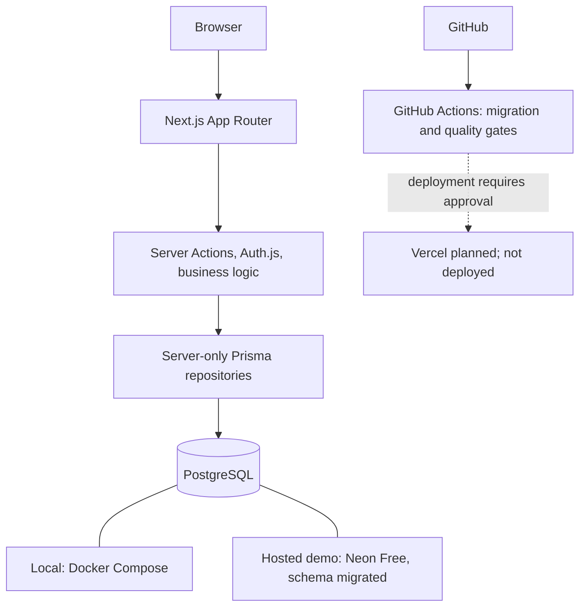

# Architecture

## Current implementation checkpoint

The public site and responsive dashboard are implemented. The database foundation includes local PostgreSQL Compose configuration, Prisma 7.10.0 schema/configuration, the initial, account-status, and request-rate-limit SQL migrations, and one server-side Client module at `src/server/db/client.ts`. Prisma connects to local PostgreSQL and reports all three migrations up to date. Staff authentication and role checks are implemented in code; transactional credential and staff-management tests pass, while a full browser login with a provisioned account is not yet verified. Public lead intake and protected lead management are implemented and tested against PostgreSQL using rolled-back transactions. The dashboard reads real PostgreSQL aggregations for all-lead counts, recent leads, six UTC calendar months, and Service enquiry ranking. ADMIN Service, Testimonial, Website Settings, and staff-account management are implemented. A fictional public browser enquiry was verified in durable PostgreSQL; signed-in admin browser workflows remain unverified.

## System overview and approved stack

NexaService is one Next.js App Router full-stack application. React and Tailwind CSS provide the UI; TypeScript is used across application code. Auth.js handles staff authentication, Zod validates inputs, current forms use React action state, and server-side business logic uses Prisma to access PostgreSQL. Vitest runs current tests. GitHub Actions CI passed its first `main` run with clean-database migrations and quality checks; This documentation branch still needs its own remote CI run. React Hook Form, React Testing Library, Playwright, and Vercel deployment remain approved for later work. The Neon Free project for fictional data is reachable and has all three checked-in migrations; no hosted application is configured to use it yet. Docker Compose defines local PostgreSQL. There is no separate Express backend.

## Runtime and verification topology



The diagram shows alternative database environments, not simultaneous writes to two databases. CI starts its own disposable PostgreSQL service; it has no Neon credentials and does not deploy. A hosted Next.js application and its Neon runtime connection remain pending written hosting approval, production ADMIN approval, and release checks.

## Public and private boundaries

- `/admin` and its child routes use a server-checked staff layout. `/admin/login` stays public. Lead routes read real Lead data. Service, Testimonial, Settings, and Users management pages require ADMIN.
- Public routes render approved site content and accept contact/enquiry submissions. Public visitors have no account or access to leads, notes, assignments, and dashboard data.
- Dashboard routes require a verified staff session. Only ADMIN and STAFF exist as internal roles.
- Route/layout checks help navigation, but each private read and mutation independently checks identity, role, and resource scope on the server.
- Return minimal view data; never pass private fields into public pages or client bundles.

## Server-side business logic

Pages and components focus on rendering. Server Actions handle form-driven application mutations where appropriate. Route Handlers are reserved for explicit HTTP endpoints when useful. Both call shared validation, authorization, and business services. Prisma calls stay in a server-only data-access layer, not scattered across React components. Server Components may initiate reads through that layer.

The centralized Prisma module uses the PostgreSQL driver adapter required by Prisma 7 and reuses one Client instance during development hot reload. It reads `DATABASE_URL` only when imported at runtime; schema validation and Client generation do not connect to a database.

Login and public enquiry actions consume atomic PostgreSQL rate-limit buckets before credential lookup or Lead creation. The security layer derives an HMAC key from the request's trusted Vercel client IP and `NEXTAUTH_SECRET`; the repository stores only the key, count, and expiry. This uses the existing database and deployment architecture. Outside Vercel, an unidentified shared bucket is used until a trusted proxy is configured.

## Authentication and authorization

NextAuth.js 4.24.15 uses a credentials provider and the Prisma `User` table. Credentials are validated with Zod, email is trimmed/lowercased, and bcryptjs compares password hashes only for ACTIVE users. Auth.js issues an eight-hour JWT session in its HTTP-only cookie. The JWT/session expose only user ID, name, email, and role; no password hash or account status. `getServerSession` plus a fresh database lookup in `src/server/auth/authorization.ts` checks that the user is still ACTIVE and uses the current role. Disablement therefore revokes protected access for already-issued sessions without waiting for JWT expiry; the cookie itself is not remotely erased. The protected route group redirects visitors to `/admin/login`; private pages and actions check identity again. Both ADMIN and STAFF currently see all leads and can change status/add notes; only ADMIN may assign an active account. This initial visibility rule and unrestricted status transitions need product review before production. No public registration exists.

## Request flows

1. **Public enquiry (implemented):** `/contact#request-quote` form -> Server Action consumes a shared rate-limit attempt -> Zod validation and honeypot check -> enquiry service verifies any selected Service is published -> Prisma repository creates a `NEW`, unassigned Lead -> a public success/error state containing no Lead fields. No staff session is required.
2. **Lead read (implemented):** dashboard request -> fresh session/User check -> Zod validation of filters or lead ID -> Prisma repository query with bounded search, filters, and 50-row pages -> selected lead data and private notes in the protected view.
3. **Lead mutation (implemented):** Server Action -> fresh session/User check -> service-level STAFF or ADMIN role check -> Zod validation -> repository status/note/assignment write -> safe result and revalidated list/detail. The note author ID comes only from the session.
4. **Service content edit (implemented):** ADMIN page/Server Action -> fresh User and ADMIN check -> Zod validation and slug conflict check -> Service repository write -> revalidate admin list, public listing/detail, and contact form. Public repository reads use `published = true`; old Leads retain their Service relation when a Service becomes unpublished.
5. **Testimonial content edit (implemented):** ADMIN page/Server Action -> fresh User and ADMIN check -> Zod validation -> repository write -> revalidate admin list and homepage. Public reads explicitly filter `published = true`.
6. **Website settings edit (implemented):** ADMIN form/Server Action -> fresh User and ADMIN check -> Zod validation -> repository upsert at `id = 1` -> revalidate public layout. Public layout, metadata, and pages share a request-cached settings read; a missing row returns a name-only fallback without writing a record.
7. **Dashboard analytics (implemented):** `/admin` -> fresh STAFF/ADMIN check -> dashboard business service defines a six-month UTC window and fills zero months -> repository uses database status grouping, bounded count/date queries, five selected recent rows, and relation counts for up to five Services. It includes unpublished Services for historical reporting. No public analytics endpoint or full-table Lead fetch exists.
8. **Staff account change (implemented):** ADMIN page/Server Action -> fresh ACTIVE ADMIN check -> Zod validation -> business service hashes a new password when creating -> repository transaction serializes account changes, rechecks the actor, and blocks self-disablement/demotion and loss of the last active ADMIN -> safe result. Lead assignment choices and checks require ACTIVE assignees; historical foreign keys remain unchanged.

## Proposed application structure

Current relevant structure (future feature modules may be added as planned):

```text
src/app/(public)/                    public pages
src/app/admin/login/                public staff sign-in page
src/app/admin/(protected)/          authenticated workspace routes and shell
src/app/api/auth/[...nextauth]/     Auth.js HTTP handler
src/server/auth/                   credentials, session options, authorization
src/server/security/               shared request-rate-limit policy and keyed identity
src/server/db/                     centralized Prisma client
src/server/db/repositories/rate-limits.ts  atomic PostgreSQL counters
src/server/db/repositories/        public lead-intake Prisma queries
src/features/enquiry/              validation and creation rules
src/components/public/enquiry-form.tsx  quote form UI
src/features/leads/                protected lead validation and business rules
src/features/dashboard/            dashboard metric definitions and UTC window
src/features/staff/                staff validation and business rules
src/server/db/repositories/staff.ts  selected staff reads and serialized account changes
src/app/admin/(protected)/users/    ADMIN staff pages and Server Actions
src/server/db/repositories/dashboard-analytics.ts  bounded Lead and Service aggregations
src/features/services/             Service validation and management rules
src/features/website-content/      Testimonial and Settings validation/business rules
src/server/db/repositories/website-content.ts  published and admin content reads/writes
src/app/admin/(protected)/testimonials/  ADMIN Testimonial pages and actions
src/app/admin/(protected)/settings/      ADMIN singleton Settings page and action
src/server/db/repositories/services.ts  admin and published-only Service queries
src/app/admin/(protected)/services/ ADMIN Service pages and actions
src/app/(public)/services/          dynamic published listing and detail
src/server/db/repositories/lead-management.ts  selected lead reads and writes
src/app/admin/(protected)/leads/    lead list, detail, and Server Actions
src/components/dashboard/          dashboard UI, lead forms, and login/logout controls
scripts/provision-admin.ts         explicit development administrator creation
scripts/bootstrap-production-admin.ts  explicit one-time production ADMIN creation; never runs at startup
scripts/recover-production-admin-password.ts  explicit existing production ADMIN password recovery
prisma/                            schema and migrations
tests/auth/, tests/enquiry/, tests/leads/, tests/services/, tests/website-content/  current workflow tests
```

The App Router route group keeps the login page outside the protected layout without changing `/admin` URLs. The Auth.js handler is the only implemented HTTP endpoint; public lead creation and protected lead changes use Server Actions.
